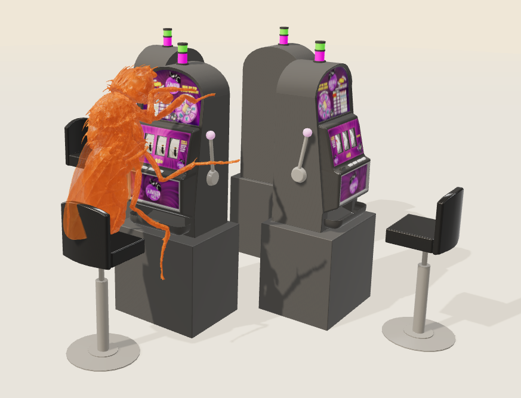
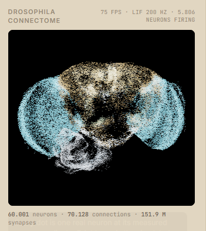
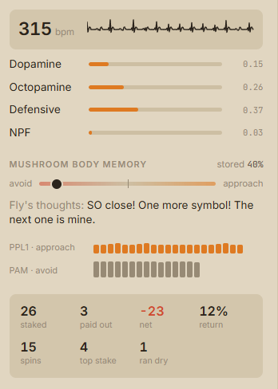

<div align="center">
  

  # Fruit Fly Slot Machine

  **A real fruit-fly connectome, a stubborn little gambler, and a slot machine that never pays.**

  [](https://male-cns.janelia.org/)
  [](#whats-real)
  [](#whats-real)
  [](#run-it-locally)
  [](#credits--licenses)

  [The piece](#the-piece) · [Run locally](#run-it-locally) · [How it works](#how-it-works) · [Credits](#credits--licenses)
</div>

---

## Fly Lab

The site is **Fly Lab**: a hub at `/` with one tile per experiment, all built on the same fly and the same connectome.

| Path | Experiment |
| --- | --- |
| `/casino/` | **Fruit Fly Slot Machine**, described below |
| `/bar/` | **Fruit Fly at the Bar**, see [The bar](#the-bar) |
| `/trade/` | **Fruit Fly Trading Desk**, see [The trading desk](#the-trading-desk) |

New experiments get a page folder (`<name>/index.html`), an entry in `src/entries/`, a Vite input in `vite.config.js`, a row in `seo/content.js`, and a tile in `index.html`.

## The piece

An adult *Drosophila melanogaster* micro-CT scan sits at a one-armed bandit and plays by itself. Its brain glows beside it: **60,001 neurons at their measured positions**, driven by a compact model over the **MaleCNS v1.0** connectome.

The fly is not controlled by the visitor. It sets its own stake, remembers how little comes back, chases losses when its satisfaction signal is low, becomes defensive as credit runs out, and eventually goes broke. There is no real currency, no purchasing, and no tracking—only a browser-side neuroscience artwork.

| Watch the fly | Inspect the brain | Read its state |
| :---: | :---: | :---: |
|  |  |  |
| **A real CT scan works the lever.** | **Measured anatomy lights up.** | **State, memory, and return history alter its choices.** |

## What’s real

| Real, measured material | The model built on top |
| --- | --- |
| **Fly anatomy** — an adult *Drosophila* micro-CT scan. | **Neural activity** — no one has recorded a fly at a slot machine; activity is a rate model. |
| **MaleCNS v1.0** — curated cells, soma positions, cell types, transmitter predictions, and 151.9M synapses. | **The game** — reels, odds, credits, and the translated inner monologue are authored. |
| **Mushroom-body circuit identity** — PAM, PPL1, Kenyon-cell, and MBON relationships come from the connectome. | **Behavioural interpretation** — signals are a legible interpretation of the model, not a clinical measurement. |
| **3D cabinet and fly assets** — credited CC BY 4.0 source models. | **Cortisol meter** — a clearly labelled stress proxy; flies do not produce cortisol. |

The distinction is deliberate: the wiring is evidence; the performance is an interpretation of what that wiring might do in this impossible situation.

## How it works

### A compact live brain model

The original graph is too large to run raw in a browser tab, so measured synapses are collapsed into a **1,600-type signed weight matrix** while the scene still draws 60,001 individual neurons at their measured locations. The model continuously integrates type activity and projects the result back to the visible neurons.

```text
driveᵢ = gain × Σⱼ Wᵢⱼrⱼ + inputᵢ
rateᵢ  ← rateᵢ + (activation(driveᵢ) − rateᵢ) × dt / τ
```

Reel motion, reaching for the lever, reward, loss, arousal, and defensive state inject current into relevant real populations. The visible response is driven by the connectome rather than a scripted light show.

### Learning changes the next stake

The fly’s mushroom body updates its KC→MBON synapses during play:

- **PAM** reward activity weakens avoidance-driving MBON pathways.
- **PPL1** punishment activity weakens approach-driving MBON pathways.
- A separate return-memory signal records whether credits are actually coming back.

The next bet combines pursuit, recent reward, learned value, defensive caution, and return history. After sustained bad returns, the fly protects credit by capping its stake—even though it may still pull the lever.

### A readable live state

The right rail exposes the state instead of hiding it: heart rate, dopamine, octopamine, defensive state, NPF, an expandable colour-coded **stress proxy**, mushroom-body learning, the fly’s thoughts, and a complete credit ledger. The experience is responsive: on a phone, the scene remains touch-safe and the information rail follows beneath it without clipped text or overlapping controls.

## The bar

The second experiment for the same fly, at `/bar/`. Both experiments are reached from the **Fly Lab** hub at `/`, a plain HTML page with a tile for each one. The hub loads no JavaScript, and each experiment page links back to it.

At the bar the fly sits on the same stool at a counter with a beer and a tin of nicotine pouches. Nobody controls it. It decides whether to drink, how many sips (1–5), whether to take a pouch and how strong (3–16 mg), and when to stop. Those choices come from its state: neuropeptide F, dopamine, what its mushroom body has learned, the hangover, nicotine craving, and disinhibition.

| What the drug does to the wiring | What it does to the fly |
| --- | --- |
| **Ethanol** strengthens every GABA synapse (GABA-A/Rdl potentiation) and weakens acetylcholine and glutamate ones. | Rising ethanol drives the PAM reward cluster. The first sips are aversive, and that fades. Past its sedation threshold it passes out. Rapid tolerance raises that threshold night by night. |
| **Nicotine** strengthens every cholinergic synapse. That is 911 of the 1,600 simulated cell types. | It lifts dopamine and builds dependence, and a falling level turns into craving. Too much at once saturates the network, and the fly has a seizure. |
| **Hangover** leaves GABA weaker than normal (rebound) and drives PPL1 while the Kenyon cells still code the bar. | NPF drains and the mushroom body learns the morning after. Drinking masks it, and a fly low on NPF takes that deal ("hair of the dog"). |

The drugs act through a per-transmitter multiplier on the measured synapses (`src/neural/pharmacology.js`), using each cell type's predicted transmitter from MaleCNS. The mechanisms are the literature's. The magnitudes and the human-scale units (mM ethanol with ‰ alongside, ng/mL nicotine) are the model's, chosen to be legible rather than fitted.

## The trading desk

The third experiment, at `/trade/`. The fly sits at a desk in front of six screens and paper-trades **$BNNA** (banana futures) by pressing a BUY and a SELL button with its right foreleg. It holds anything from five units short to five units long. Nobody controls it.

The six screens are the price chart, the news wire, its P&L race against the market, the order book, the whole session with every fill it made, and its own brain, live. The price chart in the middle of the top row is the one fed to its eyes. Its gaze wanders to the others, to the wire when a headline breaks and to the race after a fill.

What makes it more than a bot is **how the fly reads the chart**:

- **It sees the trend.** The chart drives the real vertical motion detectors of the optic lobe: T4c/T5c for upward motion and T4d/T5d for downward. The trend it trades on is read further downstream, from the cell types its own wiring makes direction-selective. `TraderBrain` finds those types at start-up by probing the connectome. On MaleCNS it picks **LPi34, Tlp14 and LPC2** for upward motion and **VS, LPi43 and LPT100** for downward. VS cells prefer downward motion in real flies too.
- **Momentum is a reflex.** Flies turn with wide-field motion (the optomotor response). The same pull decides which way it leans.
- **A crash is a loom.** A red bar growing fast on screen drives the looming detectors LPLC2 and LC4. Those converge on the giant fibre DNp01, the escape command neuron. When DNp01 crosses threshold in the simulation, the fly panic-sells everything.
- **Its biases emerge.** It sells winners early while dopamine is up (the disposition effect) and holds losers until the loss hurts more than admitting it (loss aversion). After a losing run, low NPF makes it size up. Realised profits drive PAM and losses drive PPL1, so its mushroom body learns the market.
- **It is benchmarked.** Buy-and-hold and a coin-flip trader get the same $10,000, the same fees and the same decision moments.

`node tools/sim-trade.mjs --league 8 8` plays eight seeded markets. In a typical run the fly **wins 60–80% of its closes yet beats buy-and-hold in only about half the markets**, because it keeps selling winners early. It beats the coin in most of them.

The market is synthetic and seeded (`?seed=42` replays one exactly), and the money is paper. Nothing here is a real market or investment advice.

## Run it locally

### Requirements

- Node.js 18 or newer
- npm
- A browser with WebGL enabled

### Development

```bash
npm install
npm run dev
```

Vite prints the local URL (normally `http://localhost:5173`): the hub, with the experiments at `/casino/` and `/bar/`. The committed browser assets mean the application runs immediately after dependencies are installed.

### Production build

```bash
npm run build
npm run preview
```

### Docker

```bash
docker compose up --build
```

The default host port is `3006`. Choose another with `PORT=8088 docker compose up --build`.

## Verify it

```bash
# Build the static site, metadata, sitemap, and AI-readable summaries
npm run build

# Exercise timing, reel alignment, win distribution, RTP, and return memory
node tools/test-machine.mjs

# Play a deterministic headless session
node tools/sim-session.mjs 3 20260919

# Several nights at the bar, headless: every decision, body level and memory
node tools/sim-bar.mjs 12 1

# Trading, headless: every order and why; --league compares fly, buy-and-hold and a coin
node tools/sim-trade.mjs 8 1
node tools/sim-trade.mjs --league 8 8

# Can the foreleg reach both trading buttons?
node tools/check-trade-reach.mjs
```

The game model is deterministic under a seed, which makes behavioural changes reviewable rather than anecdotal.

## Project map

```text
src/
  entries/     one entry per experiment page, mounted through mount.jsx
  hub/         the Fly Lab hub's stylesheet (the hub itself is index.html)
  scene/       Three.js scenes (casino, bar, trading desk), fly rig, props, cameras
  game/        deterministic state machines and decision policies: machine.js, bar.js,
               trader.js and the seeded market it trades, market.js
  neural/      connectome loading, rate model, learning, drug pharmacology, visual scope
  audio/       synthesized Web Audio feedback; no sampled soundtrack
  ui/          live readouts, stress meter, thoughts, memory, ledger, slips
seo/           titles, canonical URLs, structured data, sitemap, llms files
tools/         asset processing, measurement, rendering, and simulations
public/
  data/        compact browser-ready neuron and graph data
  models/      processed fly and slot-machine models
docs/screenshots/  README visuals
```

## Publishing and discoverability

`site.config.js` is the single source for the public URL, credited authors, repository, operator, and host details. The build generates page titles, descriptions, canonical URLs, Open Graph/Twitter cards, JSON-LD, `sitemap.xml`, `robots.txt`, `site.webmanifest`, `humans.txt`, `llms.txt`, and `llms-full.txt`.

Before deploying, replace the remaining host and privacy-policy placeholders in `site.config.js`. Then submit the generated sitemap to the relevant webmaster tools.

## Credits & licenses

- **Connectome:** [MaleCNS v1.0](https://male-cns.janelia.org/) by FlyEM/HHMI Janelia, University of Cambridge, MRC LMB, and Google Research — CC BY 4.0.
- **Fruit fly model:** [Drosophila adult fruit fly CT scan](https://sketchfab.com/3d-models/drosophila-adult-fruit-fly-ct-scan-ad29b897bd2b4e27bb04ab9d31baa117) by etainproject — CC BY 4.0.
- **Slot-machine model:** [Pillar Slots](https://sketchfab.com/3d-models/pillar-slots-91e255e5a95745f4857607b388421ee1) by local.yany — CC BY 4.0.
- **Project authors:** [ryhox](https://github.com/ryhox), [Nexor](https://github.com/plattnericus) and [peramanu](https://github.com/peramanu).

The project code is released under the [MIT License](LICENSE). Asset and dataset licenses remain those of their respective creators.
